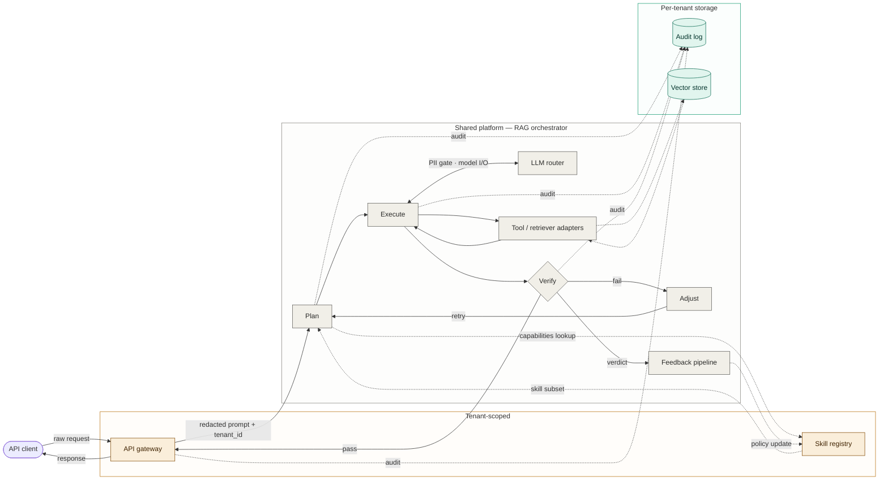

# system-diagram-in-mermaid

An [Agent Skill](https://docs.claude.com/en/docs/claude-code/skills) for Claude Code that draws system architecture diagrams that are actually legible — using Mermaid as the rendering target and elk as the layout engine.

Status: experimental, v0.2. See [Limitations](#limitations) before depending on it.

## What this fixes

The default failure mode for AI-generated system diagrams is the *noun inventory*: every component as a box, every relationship as an arrow, color used decoratively, layers stacked vertically as if hierarchy were the same as call order. The result reads like an org chart of the codebase, not like an explanation of what the system does.

This skill replaces "draw boxes for every component you see" with a procedural loop:

1. **Pick the diagram's job** — trace, topology, failure path, or cross-cadence loop. Don't mix them.
2. **Plan the trace in plain text first** — concrete entry point, ordered path, semantic axis, out-of-scope fence.
3. **Map to Mermaid primitives** — components on the path become nodes; semantic groups become subgraphs; cross-cutting concerns (auth, redaction, audit, rate limiting) become edge labels, not boxes.
4. **Render with elk, not dagre** — elk minimizes edge crossings and handles subgraphs well.
5. **If iterating on a messy diagram, diagnose first** — name the failure modes before redrawing.

## Before / after

A canonical example: drawing a request-flow diagram for a multi-tenant retrieval-augmented generation (RAG) service.

### Before — a typical AI-generated first attempt

Without procedural guidance, an AI assistant typically produces something like:

- 14+ boxes representing every named component, all roughly equal weight
- Components stacked in horizontal layers ("frontend / app / data") even when call order doesn't match the layering
- Color used decoratively — adjacent boxes share a color because they happen to be in the same row, not because they share a category
- Cross-cutting concerns (auth, PII redaction, rate limiting, audit logging) drawn as peer boxes with their own arrows, creating false call relationships
- Multi-write sinks (audit logs, metrics) drawn as separate writes from each component, multiplying edge clutter
- No labeled response path back to the user
- Trust boundaries implied by spatial grouping but not encoded

The result looks complete but doesn't help a reader understand how a request actually flows. See [`examples/anti-patterns.md`](examples/anti-patterns.md) for the failure modes in detail.

### After — same architecture, drawn under this skill's procedure



What changed:
- One trace, end to end (client → audit log → response back to client)
- Three subgraphs encode trust boundaries (tenant-scoped, shared platform, per-tenant storage)
- PII redaction sits *on* the edge it intercepts, not as a floating box
- The audit log is one sink with multiple dotted incoming arrows, not four redundant writes
- The cross-run feedback loop is drawn as a separate dotted edge, visually distinct from the request flow
- Verify is drawn as a decision diamond — the architectural choice (pass / fail / retry) is structural, not buried in a subtitle

See [`examples/walkthrough.md`](examples/walkthrough.md) for the full plan-then-source workflow on this example.

> **Note on rendering:** GitHub's native Mermaid renders this with dagre, which produces a noticeably more tangled layout than elk. For the cleanest result, paste the source into [Mermaid Live Editor](https://mermaid.live) with the elk renderer enabled, or render in an environment that supports `defaultRenderer: 'elk'`. See [Rendering caveats](#rendering-caveats) below.

## Try it

A reproducible test prompt — paste this into Claude Code with the skill installed:

> *"Draw a system diagram for a request flowing through a multi-tenant retrieval-augmented generation service. The platform has an API gateway that does PII redaction, a shared orchestrator with plan/execute/verify/adjust stages, an LLM router with cost tiers, retriever adapters that hit a tenant-scoped vector store, an eval harness, a feedback pipeline that updates a skill registry, and a per-tenant hash-chained audit log."*

Without the skill, expect the noun-inventory failure described above. With the skill installed, Claude should produce a plan-then-source response: a short prose plan naming the trace and semantic axis, then Mermaid source roughly matching the "after" diagram.

If it doesn't, [open an issue](https://github.com/jyouturner/system-diagram-in-mermaid/issues) — that's exactly the kind of feedback this project needs.

## Install

User-level (available across all projects):

```bash
git clone https://github.com/jyouturner/system-diagram-in-mermaid.git \
  ~/.claude/skills/system-diagram-in-mermaid
```

Project-level (vendored into a single repo):

```bash
git clone https://github.com/jyouturner/system-diagram-in-mermaid.git \
  .claude/skills/system-diagram-in-mermaid
```

Claude Code auto-discovers skills under `~/.claude/skills/` and `<project>/.claude/skills/`. The skill description tells Claude when to invoke it — you don't need to call it explicitly.

To verify it's installed:
```bash
ls ~/.claude/skills/system-diagram-in-mermaid/SKILL.md
```

## Files

- [`SKILL.md`](SKILL.md) — the skill definition and procedure
- [`references/diagnostic-checklist.md`](references/diagnostic-checklist.md) — failure modes to identify before redrawing an existing diagram
- [`references/mermaid-patterns.md`](references/mermaid-patterns.md) — Mermaid idioms (subgraphs, classDef, linkStyle, syntax footguns, standalone HTML render template)
- [`examples/`](examples/) — worked examples and an anti-pattern catalog
- [`evals/evals.json`](evals/evals.json) — test prompts for evaluating the skill (see [Evaluation](#evaluation))

## When it triggers

Claude will invoke this skill on requests like:

- "Draw a diagram of [system]"
- "Show me how [X] works" — multi-component systems
- "Architecture of [project]" / "request flow for [feature]"
- "What does [agent / pipeline / service mesh] look like end to end"
- "This diagram is messy, can you redraw it" (iteration mode)

It will *not* trigger for:
- ER diagrams → use Mermaid `erDiagram` directly
- Sequence diagrams of pure message exchange → use Mermaid `sequenceDiagram`
- State machines → use Mermaid `stateDiagram-v2`
- UI mockups, decision trees, or pure logic flowcharts

## Limitations

Things this skill does not do well, as of v0.2:

- **One zoom level only.** This skill operates at roughly the C4 "container" level — services, components, and their interactions in a single system. It doesn't help with multi-level diagrams (system context → containers → components → code). If you need that, look at [Structurizr](https://structurizr.com/) or [C4-PlantUML](https://github.com/plantuml-stdlib/C4-PlantUML).
- **Mermaid only.** No support for D2, Structurizr DSL, PlantUML, or Graphviz. The procedure generalizes; the patterns reference doesn't.
- **No support for true layered diagrams.** Mermaid `subgraph` is the only grouping primitive used. C4-style trust boundaries with explicit type semantics are approximated, not native.
- **GitHub renders dagre, not elk.** Mermaid in GitHub READMEs uses dagre. The skill's routing-quality claims assume elk. See [Rendering caveats](#rendering-caveats) below.
- **Triggering may need tuning for your prompts.** The skill description is biased toward over-triggering on system diagrams; if you find it firing on cases it shouldn't (or not firing on cases it should), see [`SKILL.md`](SKILL.md) for the description and adjust to taste, or open an issue.
- **Not benchmarked at scale.** v0.2 ships with a small `evals/` directory of test prompts but has not been tested across many models, prompts, or domains. Treat outputs as a v1, review before shipping to anything important.

## Rendering caveats

The skill's claim that "elk minimizes edge crossings" depends on the renderer the user actually uses. Mermaid v10+ supports elk via:

```javascript
mermaid.initialize({
  flowchart: { defaultRenderer: 'elk' }
});
```

| Environment | Default renderer | Quality |
|---|---|---|
| GitHub README | dagre | Acceptable, more crossings |
| GitLab README | dagre | Same as GitHub |
| Mermaid Live Editor (`mermaid.live`) | configurable | Good with elk |
| Obsidian | dagre by default, elk via plugin | Good with plugin |
| VS Code preview | depends on extension | Varies |
| Custom HTML page | whatever you configure | Best with elk |

For diagrams you intend to share via GitHub README, expect a tangled layout relative to the live-editor preview. This is a Mermaid limitation, not a skill limitation, but it's worth knowing up front.

A standalone HTML render template that uses elk is included in [`references/mermaid-patterns.md`](references/mermaid-patterns.md).

## Evaluation

The `evals/evals.json` file contains a small set of test prompts that exercise different diagram archetypes (request trace, batch pipeline, iteration-mode redraw, out-of-scope cases). To run them with the [skill-creator](https://github.com/anthropics/skills) workflow, use that skill's evaluation loop — this repo doesn't ship its own runner.

If you contribute new evals, please include both the prompt and a short note on what the resulting diagram should and should not contain.

## Contributing

See [`CONTRIBUTING.md`](CONTRIBUTING.md). Short version: issues are welcome, especially:
- Diagrams the skill produces that look wrong (please attach prompt + output)
- Diagram archetypes the skill mishandles (please describe the archetype)
- Suggestions for the diagnostic checklist or pattern reference
- Test prompts to add to `evals/`

## Versioning

This project follows semver-ish: minor versions for procedure changes, patch versions for reference-material updates, major versions for breaking changes to skill triggering or output format. See [`CHANGELOG.md`](CHANGELOG.md).

## License

MIT — see [`LICENSE`](LICENSE).
