# autoresearch — AI agent for cloud-cost optimization

A worked example of the skill applied to a Python AI agent that runs a 5-phase pipeline (CSV analysis → deep dive → source analysis → JIRA stories → evaluation) and orchestrates Copilot CLI subprocesses for the LLM-driven phases. The diagram exercises the **request-trace-trust-bounds** archetype with the Platform / SRE engineer SME persona.

This example is also a calibration artifact for the integrated panel critique (step 6 of `SKILL.md`). A first reviser pass tried to address `noun-inventory` at 22 nodes by collapsing four orchestrator nodes into one — which buried the load-bearing orchestrated-vs-single-call split and introduced a fresh `choices-buried` violation while fixing the count. The corrected filter table (see `design/integrated-flow-sketch.md` § Calibration findings) reclassifies `noun-inventory` as borderline-only: the count is surfaced to the user, who decides between consolidation and splitting. The diagram below preserves every plan-named architectural choice while still fixing the genuine `wrong-trust-surface` and `out-of-scope-sprawl` issues.

## Plan

- **Concrete entry point.** `cost_optimizer_agent.py --service "BigQuery,Dataflow" --project my-proj-prod --max-rounds 2 --budget 10`. Service mode, prior-run state in `FindingRegistry`.
- **Ordered path.** CLI → Preflight + Verification (scripted, $0) → Service-mode bootstrap → Phase 2 Deep Dive (orchestrated `discover` → `triage` → per-entity vs single-call, all in-process Python; only the per-entity / single-call investigation prompts cross into the Copilot CLI subprocess) → Phase 3 Source Analysis → FindingPipeline gates → Phase 4 JIRA Stories → Phase 5 Evaluation → Refinement decision (loop) → Merge to `FindingRegistry` → return to user.
- **Semantic axis.** Trust / execution boundary — User shell, Python orchestrator (in-process; includes Phase 2 Deep Dive stages), Copilot CLI subprocess (sandboxed), Cloud APIs, Persistent state.
- **Out of scope.** Cross-run feedback loop, behavioral learning, failure paths, dashboard internals (event stream is acknowledged in NOTES, not drawn), parallel specialist mode.

## Mermaid source

```mermaid
flowchart LR
  user([Engineer])

  subgraph ORCH [" Python orchestrator (in-process) "]
    direction TB
    cli[CLI entry · AgentConfig]
    pre[Preflight + verify open findings]
    boot[Service-mode bootstrap · synth cost_summary]
    skills{Skill has<br/>discovery script?}
    discover[discover.py · scripted gcloud]
    triage[triage.py · deterministic rules]
    spec[Per-entity specialist driver]
    single[Single-call investigation driver]
    pipe[FindingPipeline · gates]
    score[Programmatic scoring · file:line · savings grounding]
    refine{Score ≥ threshold?}
    merge[Merge to registry · delta report]
  end

  subgraph LLM [" Copilot CLI subprocess (sandboxed) "]
    direction TB
    p3[Phase 3 · source analysis]
    p4[Phase 4 · JIRA stories]
    p5[Phase 5 · actionability eval]
  end

  subgraph CLOUD [" External cloud APIs "]
    direction TB
    gcloud[gcloud / bq / aws CLI]
    gh[gh · git clone]
  end

  subgraph STATE [" Per-project persistent state "]
    direction TB
    fr[(FindingRegistry)]
    repos[(Shared repos cache)]
    out[(outputs/run-N · analysis · stories)]
  end

  user -->|"--service · --project · --budget"| cli
  cli --> pre
  pre -.->|"verification_check (scripted, $0)"| gcloud
  pre <-.->|open findings| fr
  pre --> boot
  boot --> skills

  skills -->|yes · e.g. BigQuery, Dataflow| discover
  discover -->|inventory.json| triage
  triage -->|deep_dive_queue| spec
  spec <-->|"per-entity prompt → Copilot CLI subprocess · sandboxed gcloud"| gcloud
  skills -->|no| single
  single <-->|"investigation prompt → Copilot CLI subprocess · sandboxed gcloud"| gcloud

  spec -->|specialist_*.json| pipe
  single -->|deep_dive.json| pipe

  pipe -->|story-ready findings| p3
  p3 <-->|"clone · grep code"| gh
  gh -.->|cached pull| repos
  p3 -->|source_findings.json| p4
  p4 -->|"stories/*.md + feedback template"| p5
  p5 -->|evaluation.json| score

  score --> refine
  refine -->|no · re-run weak phase| skills
  refine -->|yes| merge
  merge -.->|persist| fr
  merge -->|"agent_result.json · delta_report.md"| user

  pipe -.->|writes| out
  p3   -.->|writes| out
  p4   -.->|writes| out

  classDef orch  fill:#E8EEF7,stroke:#1F4E8C,color:#0E2747
  classDef llm   fill:#FAEEDA,stroke:#854F0B,color:#412402
  classDef cloud fill:#F1EFE8,stroke:#5F5E5A,color:#2C2C2A
  classDef store fill:#E1F5EE,stroke:#0F6E56,color:#04342C

  class cli,pre,boot,skills,discover,triage,spec,single,pipe,score,refine,merge orch
  class p3,p4,p5 llm
  class gcloud,gh cloud
  class fr,repos,out store

  style ORCH  fill:#E8EEF722,stroke:#1F4E8C
  style LLM   fill:#FAEEDA22,stroke:#854F0B
  style CLOUD fill:#F1EFE822,stroke:#5F5E5A
  style STATE fill:#E1F5EE22,stroke:#0F6E56
```

## Notes

- **Dashboard event stream.** The orchestrator emits a structured event stream consumed by an external dashboard. Internals belong in a sibling observability diagram; intentionally omitted here per the plan's out-of-scope fence.
- **Architectural choices surfaced visually.** (a) Orchestrated-vs-single-call split — the `skills{}` decision diamond fans out to the `discover → triage → spec` pipeline on the "yes" branch and to `single` on the "no" branch; both branches converge into `pipe`. (b) Refinement loop — the `refine{}` decision diamond with an explicit back-edge to `skills` on the "no" branch. (c) Trust crossing for LLM-driven cloud calls — `spec` and `single` live in ORCH (Python drivers) but their `<-->` edges to `gcloud` are explicitly labeled as crossing into the Copilot CLI subprocess. (d) Phase 4 vs Phase 5 distinction preserved as separate `p4` (story authoring) and `p5` (actionability evaluation) nodes.
- **Renderer config.** `flowchart LR`, elk renderer (`defaultRenderer: 'elk'`, `curve: 'basis'`, `nodeSpacing: 50`, `rankSpacing: 60`). On GitHub (dagre-only) routing will be looser. For best results, paste into Mermaid Live Editor with elk enabled.

## Panel summary (from step 6)

Panel revised two issues: `wrong-trust-surface` (the DEEP subgraph crossed the named trust axis — its in-process Python nodes moved into ORCH where they actually execute, with the Copilot-CLI-subprocess crossing made explicit on the `spec`/`single` edges) and `out-of-scope-sprawl` (dashboard event-stream sink removed; dashboard internals were declared out of scope). Four borderline issues surfaced: `noun-inventory` at 21 nodes (hard-fail band — the count reflects load-bearing structural detail like the orchestrated-vs-single-call split and the Phase 4/5 distinction; consider drawing a sibling topology diagram if 21 nodes is hurting readability), `choices-buried` on the programmatic-scoring node, plus `decorative-color` and `inconsistent-edge-style` calls.
