# graphql-node — Lambda-fronted GraphQL data gateway

A worked example of the skill applied to an AWS Lambda + Serverless Framework project that exposes a Data Gateway HTTP API in front of an in-process GraphQL engine. Clients call `/v0/query?queryId=...`, the gateway loads a persisted query template from disk, executes it against an Apollo schema, and resolvers fan out to upstream HTTP services.

The diagram exercises the **request-trace-no-trust-bounds** archetype with the Backend / API engineer SME persona — there's no real trust boundary in the codebase (single AWS account, all upstreams via plain HTTPS), so the semantic axis is deployment locality rather than security. Step 6 revised the original `others` node and its dotted `sibling traces` edge — the plan declared other queryIds out of scope, but the diagram drew them anyway. They're acknowledged in NOTES instead.

## Plan

- **Concrete entry point.** Client `GET /v0/query?queryId=postNBASignInRequest&device=mobile&root=postSignInScreen` with `preAuthorizedEntitlements` in the body.
- **Ordered path.** API Gateway → `graphqlApi` Lambda handler → `getGraphQlQueryAndVariables` (loads `.txt` + `_variables.json` from disk, merges qs + body) → `graphql exec` → resolver fan-out via `dataSources` (`entitlementNormalizer.normalize`, `tpm.getJson` — parallel) → field resolver `SubscriptionsAndUpsell.upsell` picks chunk by `(playStream, device)` → handler shapes response (`data[root]` if `root` query-param set) → HTTP response back to client.
- **Semantic axis.** Deployment locality — API-Gateway-fronted Lambda, in-Lambda GraphQL runtime, persisted-query store on Lambda FS, external HTTP data sources.
- **Out of scope.** The standalone `graphqlServer` playground Lambda, `echo` and `mobileProduct` Lambdas, the CodeBuild/CodePipeline path, the scheduled `rate(1 minute)` warm-up event firing `appPromos`, other queryIds (same shape, different upstream fan-out), and failure / caching paths. Each would be a sibling diagram.

## Mermaid source

```mermaid
flowchart LR
  client([Client app])

  subgraph EDGE [" AWS edge "]
    apigw[API Gateway<br/>/v0/query]
  end

  subgraph LAMBDA [" graphqlApi Lambda · src/endpoints/graphqlApi.js "]
    direction TB
    handler[handler<br/>extract queryId / root]
    loader[getGraphQlQueryAndVariables<br/>merge vars from qs + body]
    gql["graphql exec<br/>schema + resolvers"]
    resolver[postSignInScreen resolver<br/>src/graphql/resolver/upsell.js]
    field["SubscriptionsAndUpsell.upsell<br/>pick chunk by playStream + device"]
    shape["shape response<br/>data[root] if root set"]
  end

  subgraph QSTORE [" Persisted-query store (Lambda FS) "]
    qtxt[("src/queries/*.txt<br/>+ _variables.json")]
  end

  subgraph UPSTREAM [" External HTTP data sources "]
    direction TB
    norm[Entitlement Normalizer]
    tpm[TPM config JSON<br/>upsell.json / sales_sheets]
  end

  client -->|"GET /v0/query?queryId=postNBASignInRequest&device=mobile&root=postSignInScreen"| apigw
  apigw -->|Lambda invoke event| handler
  handler --> loader
  loader -.->|readFileSync| qtxt
  qtxt -.->|query text + default vars| loader
  loader -->|"{query, variables}"| gql
  gql --> resolver
  resolver -->|"normalize(preAuthEntitlements)"| norm
  resolver -->|"getJson(upsellUrl)"| tpm
  norm -.->|"products[]"| resolver
  tpm -.->|upsell options JSON| resolver
  resolver --> field
  field --> shape
  shape -->|"200 · data[root]"| apigw
  apigw -->|HTTP response| client

  classDef edge   fill:#E6EEF8,stroke:#22518C,color:#0E2A4F
  classDef app    fill:#F1EFE8,stroke:#5F5E5A,color:#2C2C2A
  classDef store  fill:#E1F5EE,stroke:#0F6E56,color:#04342C
  classDef ext    fill:#FAEEDA,stroke:#854F0B,color:#412402
  classDef actor  fill:#FFFFFF,stroke:#3d3d3a,color:#3d3d3a

  class client actor
  class apigw edge
  class handler,loader,gql,resolver,field,shape app
  class qtxt store
  class norm,tpm ext

  style EDGE     fill:#E6EEF822,stroke:#22518C
  style LAMBDA   fill:#F1EFE822,stroke:#888780
  style QSTORE   fill:#E1F5EE22,stroke:#1D9E75
  style UPSTREAM fill:#FAEEDA22,stroke:#BA7517
```

## Notes

- **Other queryIds.** The same loader → graphql-exec → resolver → upstream-HTTP shape is reused for `salesSheet`, the on-air aggregator, `vodEpisodes`, `appPromos`, NBA TV view, and Content API. They're a sibling topology diagram, not part of this trace.
- **Architectural choices surfaced visually.** The persisted-query store as a filesystem read (dotted `readFileSync` to a cylinder), parallel resolver fan-out to `entitlementNormalizer` and TPM as two solid edges from the same resolver node, and response shaping as a distinct `shape` step — `data[root]` conditional shaping is intentionally surfaced as its own node rather than hidden in a subtitle.
- **Renderer config.** `flowchart LR`, elk renderer (`defaultRenderer: 'elk'`, `curve: 'basis'`, `nodeSpacing: 50`, `rankSpacing: 60`). On GitHub (dagre) the diagram still parses but routing is slightly worse — Mermaid Live Editor with elk gives the cleanest result.

## Panel summary (from step 6)

Panel revised one issue: `out-of-scope-sprawl` (the `others` node and its dotted `sibling traces` edge dragged out-of-scope queryIds into the single-trace frame; removed and acknowledged in NOTES instead). Three borderline issues surfaced: `choices-buried` on the field resolver's chunk-selection criterion, `inconsistent-edge-style` on the sibling-traces convention (now resolved by removal), and `gates-invisible` on the parallel resolver fan-out (Mermaid lacks a native fan-out / join glyph; the parallel semantics live in the prose plan).
