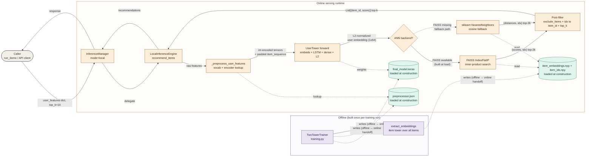

# recs_two_tower — two-tower recommendation system

A worked example of the skill applied to a Keras-based two-tower deep-learning recommendation system. Offline training writes a model + preprocessor + item-embedding artifacts; online serving loads them and answers `recommend(user_features, top_k)` calls via a user-tower forward pass plus ANN search (FAISS or sklearn fallback) over the precomputed item embeddings.

The diagram exercises the **request-trace-trust-bounds** archetype with the Platform / SRE engineer SME persona. Step 6 revised the original peer-positioned `ARTIFACTS` subgraph to fold inside `SERVING` as "loaded at construction" inputs, which makes the actual two-surface (offline / online) lifecycle axis visible — artifacts are the handoff *between* surfaces, not a third surface of their own.

## Plan

- **Concrete entry point.** A signed-in homeowner calls `service.recommend(user_features, top_k=10)` — a single online recommendation request through the `LocalInferenceEngine`.
- **Ordered path.** caller → `InferenceManager` → `LocalInferenceEngine` → `_preprocess_user_features` (vocab/encoder lookup) → `UserTower` forward (embeds + LSTM + dense + L2 normalize) → ANN search (FAISS or sklearn fallback) over precomputed item embeddings → post-filter (`exclude_items`, idx → `item_id`, top_k) → return `List[(item_id, score)]`. Plus offline → online artifact handoff (model + preprocessor + item embeddings written by training, loaded at engine construction).
- **Semantic axis.** Trust / lifecycle boundary — offline build vs online serving. Artifacts are not a third zone; they are the handoff surface, drawn as loaded-at-construction inputs inside `SERVING` with offline-write arrows crossing the lifecycle boundary.
- **Out of scope.** Training pipeline internals, Vertex AI deployment path, optimized graph-mode variant, failure / cold-start paths.

## Mermaid source

## Notes

- **Architectural choices surfaced visually.** The ANN backend selection (FAISS primary vs sklearn fallback) is a decision diamond fanning out to two branches, with the fallback drawn dotted. The artifact handoff is dotted writes from `OFFLINE` crossing into `SERVING` with explicit `(offline → online handoff)` labels — making the lifecycle boundary the actual axis the diagram encodes.
- **Renderer config.** `flowchart LR`, elk renderer, `curve: 'basis'`, `nodeSpacing: 50`, `rankSpacing: 60`. Subgraph fills use the `22` alpha suffix; classDef fills are the saturated version of the same hue family. On GitHub (dagre), routing will be looser but readable.

## Panel summary (from step 6)

Panel revised one issue: `wrong-trust-surface` (the `ARTIFACTS` subgraph was peer-positioned with `OFFLINE` and `SERVING`, but artifacts are the handoff surface, not a third lifecycle zone — folded into `SERVING` with explicit offline-write arrows crossing the boundary). Four borderline issues surfaced: `noun-inventory` at 14 nodes (soft band), `choices-buried` on `L2 normalize` (which is what makes FAISS IndexFlatIP equal cosine similarity), and two `inconsistent-edge-style` calls on the FAISS/sklearn branching.
