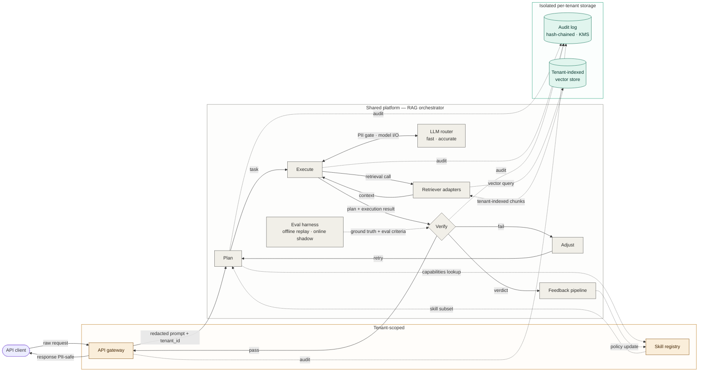

# Walkthrough — applying the procedure to a multi-tenant RAG service

A complete walkthrough of the skill's procedure, from initial prompt to final Mermaid source. The example is a generic multi-tenant retrieval-augmented generation service — a public-domain reference architecture with no proprietary content.

## Step 0 — The prompt

> *"Draw a system diagram for a request flowing through a multi-tenant retrieval-augmented generation service. The platform has an API gateway that does PII redaction, a shared orchestrator with plan/execute/verify/adjust stages, an LLM router with cost tiers, retriever adapters that hit a tenant-scoped vector store, an eval harness, a feedback pipeline that updates a skill registry, and a per-tenant hash-chained audit log."*

## Step 1 — Pick the diagram's job

The prompt describes a request flowing through the system, mentions specific components in roughly the order they're traversed, and names cross-cutting concerns (PII redaction, audit logging, multi-tenancy). This is a **request trace**, not a topology map.

The prompt also mentions feedback (eval harness → feedback pipeline → skill registry), which is a *cross-cadence loop* running on a different timescale than the request. We'll mention it but draw it minimally — the request trace is the headline.

The prompt does not mention failure recovery, batch processes (e.g., nightly index rebuilds), or observability infrastructure. We won't add them.

> "I'll draw this as a request trace — one client request flowing from the API gateway back to the API gateway. The cross-run feedback loop will appear as a side channel. Failure recovery and batch reindexing are out of scope; I'll mention them as candidates for sibling diagrams."

## Step 2 — Plan the trace in plain text

### Concrete entry point
An API client makes an inference request to the RAG service.

### The path (in order)
1. API client (external)
2. API gateway — PII redaction, tenant_id stamping
3. Plan stage — consults Skill Registry to resolve required capabilities
4. Execute stage — calls LLM router (with PII gate on I/O) and retriever adapters
5. Retriever adapters — query the per-tenant vector store, return relevant chunks
6. Verify stage — gets ground truth from Eval Harness, decides pass or fail
7. Adjust (if fail) — feeds back into Plan as a retry
8. API gateway again (if pass) — sends PII-safe response back
9. API client receives response

### The semantic axis: trust boundary

Three zones, each its own color:
- **Tenant-scoped** (amber): API gateway, Skill Registry — these have tenant identity
- **Shared platform** (gray): all orchestrator stages (plan / execute / verify / adjust), LLM router, retriever adapters, eval harness, feedback pipeline — these serve all tenants
- **Per-tenant isolated storage** (teal): Audit log, vector store — these are physically isolated per tenant

This is the most natural axis because it maps to how a security or compliance reviewer would read the diagram.

### Out of scope
- Failure recovery / circuit breakers / retries beyond the verify→adjust loop — separate diagram
- Batch reindexing of the vector store — separate diagram, different cadence
- Observability infrastructure (logs, metrics, distributed traces) — implied by the audit log, not the same thing
- Multiple simultaneous tenants — this is one request, not a load picture

## Step 3 — Map to Mermaid primitives

Mechanical translation:

- API client → `([Pill])` (external actor)
- API gateway, Skill registry → `[Box]` in `subgraph TENANT`
- Plan, Execute, Adjust, LLM router, Retriever adapters, Eval harness, Feedback pipeline → `[Box]` in `subgraph CORE`
- Verify → `{Diamond}` (it's a decision: pass or fail)
- Audit log, Vector store → `[(Cylinder)]` in `subgraph STORE`

Edges:
- Solid `-->` for the main request flow
- Dotted `-.->` for lookups (skill registry), audit writes, and the cross-run feedback signal
- Bidirectional `<-->` for LLM I/O (request goes out, response comes back, both pass through PII redaction)
- Edge labels on every cross-subgraph boundary

Cross-cutting concerns:
- PII redaction → label on the `gw → plan` edge ("redacted prompt + tenant_id") and on the `exec ↔ llm` edge ("PII gate · model I/O")
- Audit logging → single `audit` sink, four dotted incoming arrows from Plan, Execute, Verify, Gateway
- Tenant isolation on the vector store → labeled on the dotted `tools → rag` edge

Architectural choices made visible:
- The plan-execute-verify-adjust loop is a real loop: Verify can branch to Adjust, which retries via Plan
- The cross-run feedback path is shown but visually separated (different layer in the layout, dotted edge to a tenant-scoped node)

## Step 4 — Render with elk

## Step 5 — What's deliberately not in this diagram

Three sibling diagrams could follow, each with its own cadence and scope:

- **Failure recovery** — what happens when Verify keeps failing, when a retrieval times out, when the LLM provider returns rate-limit. Different shape (lots of conditional branches), different cadence (per-failure, not per-request).
- **Batch reindexing / retraining** — the periodic job that aggregates the feedback pipeline's output into a retraining queue, runs evals offline, updates the skill registry's policy, and rebuilds vector indexes. Different cadence (minutes to days), different participants (data engineering, not request serving).
- **Multi-tenant isolation review** — the same components but drawn for a security audit, with every isolation control surfaced (KMS keys, network policies, encrypted-at-rest stores, tenant-scoped IAM). Different audience (compliance), same components, different emphasis.

If a user asks for any of these, draw a separate diagram — don't try to add to this one.
